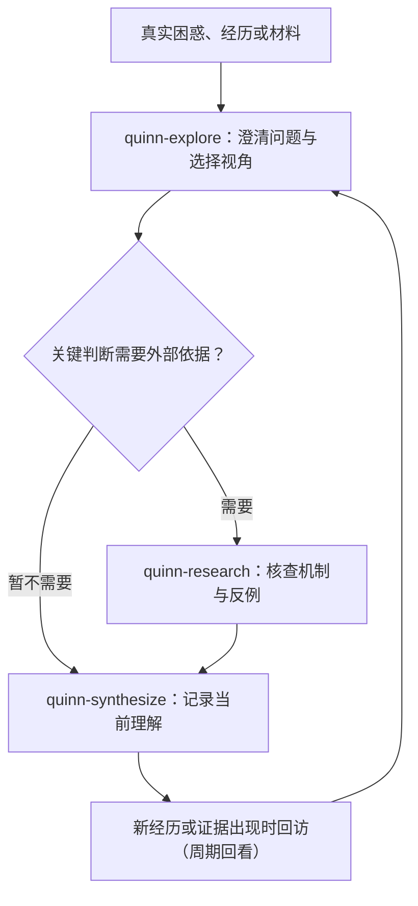

# Quinn 产品契约

日期：2026-09-25  
状态：现行。Quinn「服务什么问题、默认如何开始、什么算一次有效结果」的唯一产品真源。

实现细节见主线实现方案与数据契约，本页只定产品边界，不重复字段与交互协议。

## 1. Quinn 服务什么问题

从用户的真实困惑、经历或材料出发，接触不同解释和跨领域机制，共同形成新理解、新问题和可尝试的机会。帮助的是宏观思考、跨领域连接和判断。

Quinn 不是出题训练、不是陪练打分。案例训练是可选练习，见 §6。

## 2. 默认如何开始

默认从探索开始（`quinn-explore` 判断卡点），按问题调用另外两个职责，不按固定顺序跑三个 Skill，不要求每轮依次调用：

- 只缺事实 → `quinn-research` 核查
- 已想清楚 → `quinn-synthesize` 保存 / 总结
- 需要换角度 → `quinn-explore` 探索

## 3. 主线关系

## 4. 三种能力的归位

| 能力 | 在主线中的角色 |
| --- | --- |
| 经历复盘 | 输入来源 |
| 框架转换 | 探索动作 |
| 周期回看 | 跨会话动作 |

三者复用同一套来源归属、用户纠正和保存机制，不各建入口、不新增 Skill。

## 5. 什么算一次有效结果

- 提出了更准确的问题；
- 发现了有效反例；
- 在新材料出现后修正了判断。

允许确认原判断、澄清事实、暂无结论。有趣的类比若没有改变判断，只算灵感、不沉淀为结论。开放探索不打分。

## 6. 案例训练（已推迟）

用户主动要求时的一种可选练习，不属于默认主线，保留局部评分空间。当前不定义具体形式，待真实需求出现时另立方案。

## 7. 旧方案

「AI 商业与产品判断训练伙伴」（单 Skill、案例、评分、等级）为历史方案，已被本契约取代；原文保留在 `docs/Quinn-Research-Strategy-Implementation-Plan.md` 供对照。
